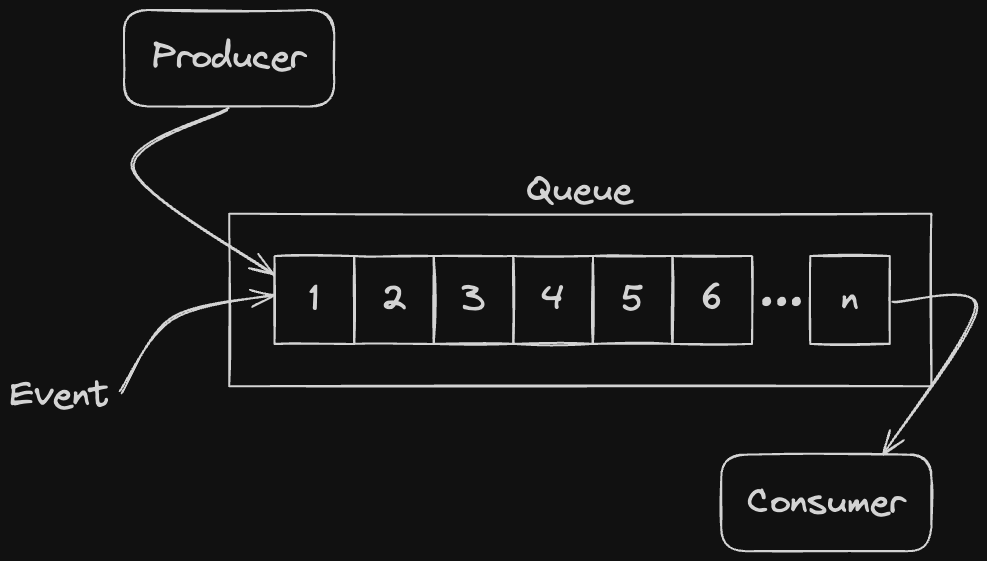
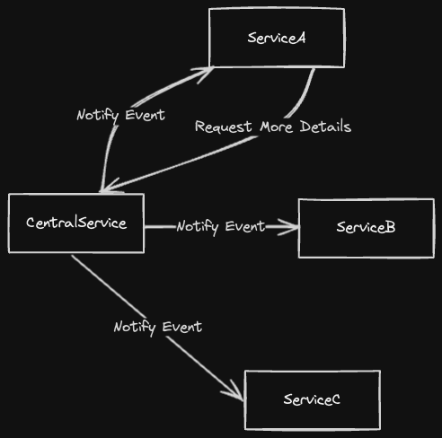
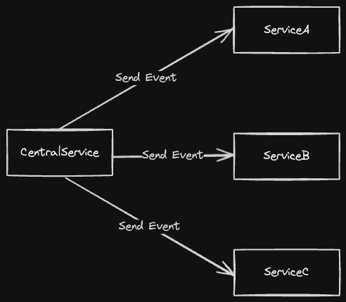
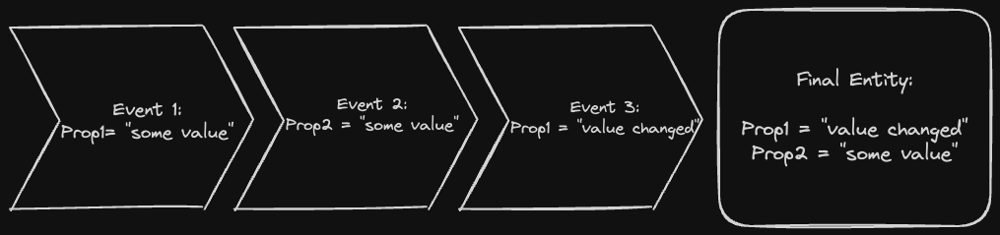

## Event Driven Concepts

### Core

In essence all event architecture is simply a producer/consumer in a queue. There can be many producers and many consumers. The next diagram represents this.



### Event notifications

-   Tipically carries a minimun state.
-   An identifier for the event.
-   The components notified can decide if need more information and request it.
-   Payload example:

```go
type PaymentReceived struct {
    PaymentID string
}
```

-   Design example:




### Event-carried state transfer

-   Similar to REST, but with a push model instead of a pull.
-   Contains more data than an [Event notifications](#event-notifications).
-   There's less need to request extra info from the service who originated the event.
-   Payload Example:

```go
type PaymentReceived struct {
    PaymentID   string
    CustomerID  string
    OrderID     string
    Amount      int
}
```

-   Design example:



-   Some services may receive more data than needed.


### Event sourcing

-   The event won't contain the full data. Instead it'll be a collection of events in time that can be aggregated to obtain the final state.
-   Events are stored in an **event store**, instead of being sent to the other components.
-   There's no specific payload for this kind of events.
-   Design Example:




### Queues

-   It's a `first-in-first-out` **FIFO** struct. In events domain this holds true __"most of"__ the cases.
-   Can be refered in a variety of terms: bus, channel, stream, topic, etc..

#### Message Queues

-   It's defining characteristic is it's lack of event retention. All of it's events have a limited lifetime.
-   It's useful for simple **publisher/subscriber (pub/sub)**, when the subscribers can retrieve the events quickly enough (Otherwhile they'll be lost).

#### Event Streams

-   In essence it's a **Message Queue** with retention.
-   The data is persisted and therefore it grows over time.
-   Needs some config over what's the max amount data to store, and how to delete/archive old data.

#### Event Stores

-   It's an append-only repository for events.
-   It could be compose of millions of individual **Event Streams**.
-   Provides **optimistic concurrency** controls to maintain a strong consistency on the **Event Streams**.
-   Not typically used for message communication.
-   Commonly used with [Event sourcing](#event-sourcing) to track changes to entities.


### Producers

-   Send event over some queue.
-   May include additional metadata with the event.
-   Does not know about the consumers of the events.

### Consumers

-   Subscribe to consume event from a source.
-   Can be organized into groups to share the load.
-   Can start reaing events from different points:
    -   The beginning of the stream.
    -   The new event from when they joined the stream.
    -   A cursor to pick up from where they left the stream.
