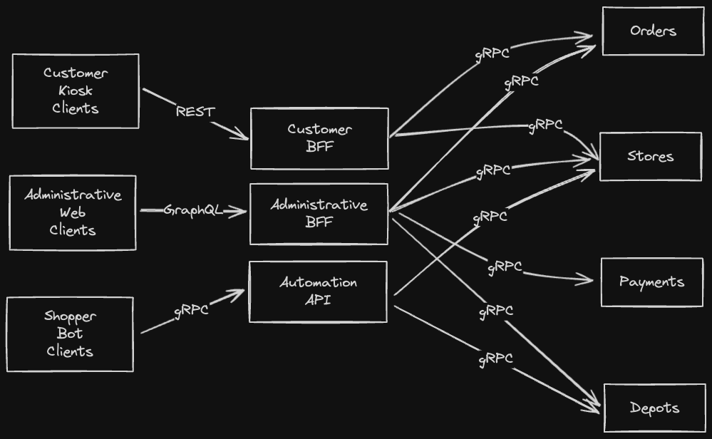

## Application

## Services

The services will comunicate using event for the state transfer and notifications. The comunication from/to the different user facing services will be using **gRPC**. The different services that face the front-end are created using the **Backend for frontend (BFF)** pattern.

### Orders

### Stores

### Payments

### Depot

